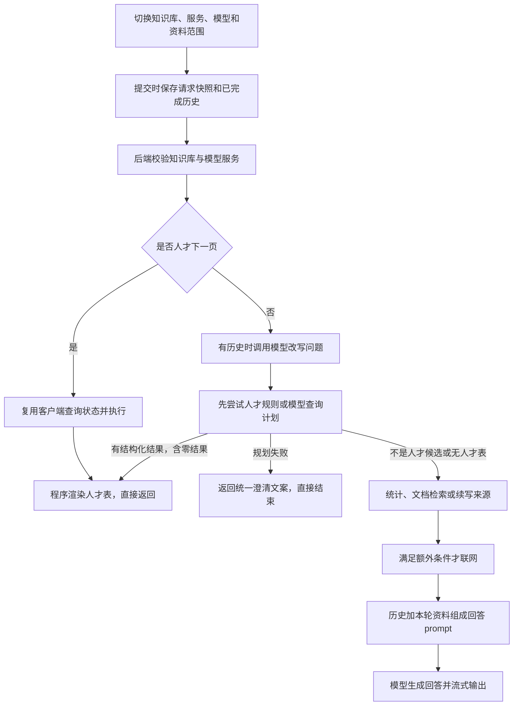
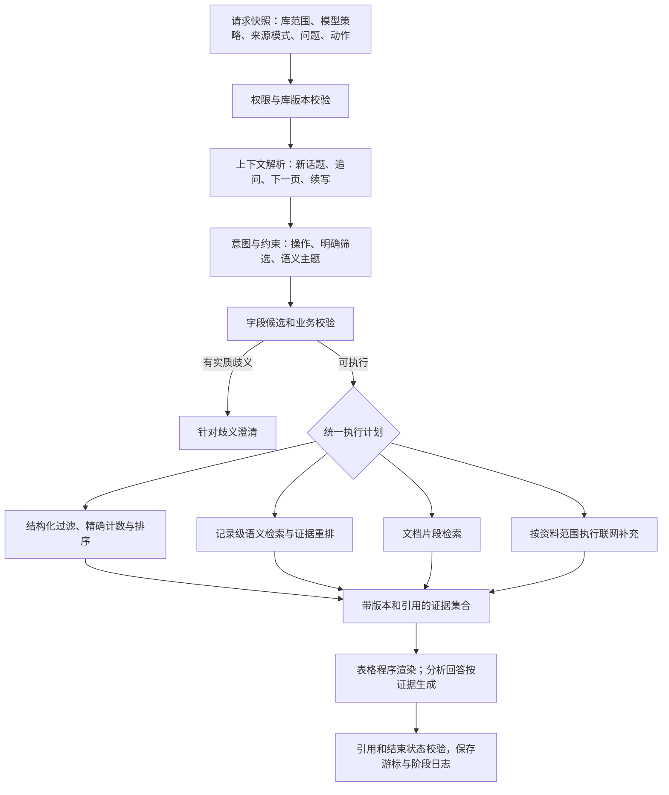

# 检索链路审查与重新设计

日期：2026-09-29。范围：前端切换与历史恢复、请求快照、上下文改写、检索路由、人才查询、文档检索、联网、prompt、流式输出、续写与分页。

本轮是代码审查和隔离验证，不修改应用逻辑、数据库数据或模型配置。文中的新流程是待实施设计，不表示已经上线。

## 结论与验证范围

问题不只在模型或某条提示词。目前缺少一个统一的、带查询范围和任务类型的执行计划。不同分支各自决定提前返回、是否保留历史、是否联网和如何分页，导致切换后的行为不一致。

- 本轮 10 个隔离探针确认了边界行为，详见 [验证结果](./retrieval-review-evidence.json)。使用内存 SQLite、合成人才表、模拟模型/搜索返回，不调用付费服务。
- 后端既有上下文、人才查询、分页、流式测试 23 项通过。既有测试通过不代表下面的边界已覆盖；部分测试明确接受了旧行为。
- 前端既有 41 项测试通过；现有测试保留跨库聊天历史，但没有证明范围隔离完整。
- 前一轮真实接口对照：相同消息，qwen-plus 1.52 秒返回 AI4S＋蛋白质；max 思考开启一次 49.57 秒返回相同条件，另一次 60.09 秒 ReadTimeout；max 临时关闭思考一次 1.53 秒返回生物医药＋蛋白质。小样本不能证明模型总体能力或长期失败率，也没有证据证明发生了 token 耗尽。
- 本轮不包含浏览器视觉操作：系统仍未授予电脑使用权限。前端判断基于组件代码与自动化测试。

## 一、当前链路

### 切换操作实际上影响什么

| 操作 | 当前实现 | 审查结论 |
|---|---|---|
| 切换知识库 | 清理检索展示与来源列表，保留聊天；由外部导航切换时中止前端生成 | 保留聊天本身合理，但普通历史轮次没有来源库信息，无法可靠划分“讨论旧回答”和“继承当前查询条件” |
| 切换模型服务 | 将模型名改为服务默认模型；新请求使用新服务 | 同时影响改写、查询计划和最终回答；Embedding 使用全局独立配置，未随之更换 |
| 修改模型名 | 新请求使用修改后的模型名 | 不会自动清理历史查询状态；人才“下一页”不调用模型，因此显示新模型不等于新模型重新检索 |
| 调整 Top K | 控制文档片段数；检索测试中也控制人才返回数 | 问答人才分页另用 talent_page_size，检索测试与问答并非同一口径 |
| 调整人才每页条数 | 新查询传 talent_page_size | 仍会被计划默认 limit=20 压低；下一页继续沿用旧 page_size |
| 选择知识库＋联网 | 前端传 web 模式 | 人才结构化分支先返回，所以不会联网 |
| 打开历史会话 | 恢复消息，并尝试恢复最后请求的知识库 | 不恢复服务、模型、分页和联网设置；旧库不可用时仍能展示旧消息并保留当前库，需要明确提示/策略 |
| 继续生成 | 使用原请求快照与旧答案作为 continuation | 普通文本续写有专门分支，人才分支却先重算并返回完整表格 |

代码入口：`frontend/src/views/RetrievalWorkspace.vue:101,178,229,270`，`frontend/src/lib/conversation.ts:5`，`backend/app/api/routes/knowledge.py:384`。

## 二、发现的问题（按优先级）

### R01 · P1：运行错误被伪装成理解失败，失败日志缺失

`talent_search.py:210-217` 将模型调用异常、JSON 错误、计划校验异常全部转成同一句澄清。`knowledge.py:341-345` 仅在模型成功返回后记录日志。适配器读取超时固定为 60 秒。

已验证：注入 ReadTimeout，得到与用户截图完全相同的“无法可靠确定筛选条件”；前轮真实 max 调用也复现了 ReadTimeout。不能根据这条页面文案推断模型没理解。

改进：区分 provider_timeout、provider_error、output_invalid、plan_invalid、needs_clarification、no_matches；所有调用记录阶段、配置版本、耗时、结束原因和 token 用量。模型成功返回 JSON 与计划通过业务校验应分开记录。错误不能作为正常“已完成答案”继续污染上下文。

### R02 · P1：人才路由过早截断语义检索和统计

`talent_search.py:204` 根据“领域、人才、推荐、机构”等词判定候选；`knowledge.py:404-430` 在文档/向量检索之前尝试结构化查询，失败直接澄清，零结果也直接结束。

已验证：模型对“找研究蛋白质的人才”返回空计划时，Embedding 和 search_chunks 调用次数均为 0。`共有多少人才` 在空计划情况下也先返回澄清，无法进入后面的全表统计。不能据此断言每个模型每次都失败，但设计上没有独立 count 操作，必须借用过滤或排序才有合法计划。

改进：先识别 list/count/compare/summarize 等操作，再区分明确筛选与语义主题。规划失败、主题歧义和精确查询确实无匹配必须走不同分支；不能无条件扩大范围或静默删条件。

### R03 · P1：计划的格式校验与业务约束脱节

`TalentPlan` 只有 AND 过滤、排序和 limit；`validate_plan` 主要校验列存在、非空和数字格式。提示词列出 domains，但程序不检查领域值是否可映射到真实候选，也没有核对每条条件的用户依据。OR、分组、主题比较只靠提示词要求输出空对象。

已验证：`领域 contains 蛋白质` 通过校验并返回 0，而不是暴露字段选择错误。已有测试还把不存在领域返回零结果作为预期。

改进：引入字段类型、允许操作、候选取值、来源短语与约束来源；枚举值不明确时做候选解析或澄清。对主题保留 semantic_query，不能为了填领域字段而强行分类。禁止模型自报“高置信”成为唯一通过条件。来源短语检查也不能独自证明语义正确，仍需业务评测。

### R04 · P1：知识库切换后的历史范围不一致

前端保留会话但 `ConversationTurn` 不含每轮来源库；普通问答没有 talent query_state。改写阶段仅在最后一轮有查询状态且库不匹配时局部清空 history；最终回答阶段仍使用 `_prepare_ask` 原始 history。

已验证：无 query_state 的旧库普通历史仍原样进入新库的改写 messages。保留历史不是错误；缺少来源标签、继承策略和统一处理才是问题。当前无法仅凭测试断言某模型一定会误用这些历史。

改进：统一区分 display_history、dialogue_context、active_query_state。聊天展示可保留；切库失效的是旧检索状态和证据引用。显式讨论旧回答时提供带来源标签的摘要，明确跨库比较另建 scope，不能让改写与回答使用不同的范围规则。

### R05 · P1：续写来源校验没有绑定当前查询范围和版本

`knowledge.py:442-451` 验证来源访问权限并从数据库重读片段，但没有验证属于当前 knowledge_base_id；网页来源直接使用客户端提交内容。片段版本也没有绑定到原回答。

已验证：测试用户可访问 A/B 两库，选择 B 并提交 A 的续写来源时，接口返回 200，A 内容进入 prompt。这是查询范围/证据完整性漏洞；不是证明可以绕过已有跨用户权限控制。正常 UI 一般使用原请求快照，但后端不能依赖 UI 保证这一点。

改进：服务端存储或验证 evidence_set_id，绑定用户、知识库范围、资料版本、查询和引用编号。授权与查询范围都检查；资料变更时明确重查或提示，不悄悄替换原证据。客户端不提交可被当作已核验事实的网页正文。

### R06 · P1：用户总量限制、分页大小和结果总数混用

`talent_search.py:218-247` 把 plan.limit 压成 page_size，再基于全部候选计算 has_more；查询状态没有保留独立的“前 N 名”总量上限。

已验证：要求前 3 名，首屏 3 条且 has_more=true，继续返回第 4–6 条。设置每页 100 条，在 35 条合成数据上实际仅返回 20 条，因为受默认计划 limit 限制。

改进：分开 matched_total、result_limit、page_size、cursor。前 3 名且每页 5 条应只显示 3 条并结束；前 20 名且每页 5 条应最多 4 页。计数说明记录条数不等于唯一人数。排序需有稳定的记录 ID 次级排序；cursor 绑定数据版本，防止资料变化后 offset 重复或漏项。

### R07 · P1：联网开关被分支顺序覆盖

人才结果抛出 PreparedTalentAnswer，后面的 `_should_run_web_search` 根本不执行；全表统计也能抑制联网。前端却允许选择“知识库＋联网搜索”。

已验证：AI4S 结构化查询且 web 模式，WebSearchClient 调用 0 次。

改进：资料范围由统一执行计划决定。需要联网时可为库内人才补充外部证据，但外部候选与库内计数分开，不让搜索结果悄悄改变库内人数；无法联网则返回明确的来源状态。

### R08 · P2：人才续写可能重复完整答案

`next_page_state` 排除 continuation，但 `_prepare_ask` 仍先执行人才规划与渲染。前端 `generateTurn` 会先放入旧文本，再追加服务端 delta。

已验证：部分人才答案的 continuation 请求返回从开头开始的完整首屏表格。与前端追加行为组合会重复。完整结构化答案本应视为原子结果，不能套用自由文本“接着写”。

改进：拆成 text_resume、structured_retry、next_page 三种动作。结构化重试替换原结果并保持幂等；下一页使用查询游标；文本续写绑定原证据集合和输出偏移。

### R09 · P2：检索测试无法直接对照问答链路

`/search` 先 Embedding/片段，再用默认服务规划人才查询；`/ask` 使用请求指定模型，先人才再片段。前端检索测试没有传所选问答模型，Top K 又兼任人才条数。

改进：两种入口复用同一 prepare/retrieve 服务。调试模式返回路由、规范化条件、候选和分数、过滤原因，不生成最终回答；明确区分不调用模型的纯召回检查与调用 planner 的完整检索检查。

### R10 · P2：回答协议没有区分截断、降级与正常结束

模型适配器未检查 finish_reason；流式看到 `[DONE]` 就结束，路由有文本就可发 done。Embedding/联网异常被静默转为空；改写失败会把上一轮问题和答案拼进查询，可能带入不再适用的条件。查不到新资料但有历史时允许调用回答模型，仅靠提示词限制新事实。

这是代码检查结果；本轮未将所有上游结束原因逐一注入验证。

改进：保留 stop/length/error/cancelled；对“基于前文改写”与“需要新证据的事实查询”明确分类。降级状态应进入结果元信息与调试记录。回答依据与失败原因不能只体现在模糊自然语言里。

### R11 · P2：模型职责和历史恢复策略不显式

同一个服务配置控制改写、规划和回答，思考/超时/输出预算没有按任务分开；恢复历史只恢复知识库和消息，不恢复模型等设置。此前真实测试已经说明规划阶段的思考会显著影响本次耗时。

改进：明确每阶段使用的模型与参数，在请求快照里冻结。模型切换对新查询、旧游标、重试和续写的作用分别定义。历史恢复要么恢复配置快照，要么明确提示使用当前配置；服务/库失效不可静默替换。

### R12 · P2：语义检索需要记录级索引与覆盖率约束

当前混合检索以片段为单位，将词频余弦与向量分数直接加权；不同索引覆盖状态会走不同打分分支，自动联网又依赖固定阈值。所有候选在应用内装载并排序，大数据量下还需容量验证。编辑后的未更新索引被排除是正确的防旧数据措施，但现在没有解释“暂不可检索”的覆盖状态。

改进：人才检索候选以 talent_id 聚合，携带命中字段与证据段落；显式条件先过滤，再在允许范围中做词法/向量召回与可评测的重排。分页来自稳定候选集合。不要把 top-K 语义候选数量称作全库精确总人数。索引覆盖、版本和降级信息可追踪。

## 三、建议的新流程

这些分支可以组合，例如“清华大学研究蛋白质的人才”使用机构过滤＋主题检索，不需要先猜蛋白质属于哪个一级领域。

### 数据与状态契约

| 对象 | 建议字段 | 负责的边界 |
|---|---|---|
| RequestScope | user、base_ids、source_policy、dataset_revision、request_id | 权限、查询范围与版本 |
| ConversationContext | turn_id、source_scope、topic_id、approved_query_state、context_kind | 显示历史与可继承状态分离 |
| QueryIntent | operation、hard_constraints、semantic_query、order_by、result_limit | 用户明确要求与主题区分 |
| ValidatedPlan | scope、typed_filters、candidate_ids、unresolved_constraints、plan_version | 可执行条件由程序校验；模型不能覆盖 scope |
| RetrievalResult | records/chunks/web、match_type、matched_total、coverage、evidence_set_id | 精确匹配与相关候选不混淆 |
| PageState | query_id、result_limit、page_size、cursor、dataset_revision | 下一页稳定、有总量上限 |
| AnswerState | answer_kind、status、finish_reason、citation_map、evidence_set_id | 续写、重试、错误与正常结束分开 |

先支持当前需要的比较、包含、范围和简单逻辑组合；未支持的条件显式报告，不能降级成更宽的查询。过滤条件编译为参数化查询或固定执行器，不执行模型生成的任意 SQL/代码。

## 四、prompt 应如何重组

不要再把所有问题都变成自由文本改写，然后直接生成表格过滤器。按职责分成以下输入输出；可合并低成本调用，但契约保持分离。

### A. 上下文与意图解析

输入：当前问题、带来源范围的对话摘要、同范围有效查询状态、允许操作。

输出：新话题/修改查询/比较前文/下一页/续写等 action，以及明确条件和语义主题。每个条件附用户原文或已确认状态的来源。不得从历史回答的人名、上一页数量推导新的筛选条件。

切换知识库后没有有效状态的“继续”，应要求建立新的查询；明确“总结上面的回答”可以使用带来源标签的旧文本。

### B. 字段与候选解析

输入：意图、字段说明、类型、允许操作，以及从当前库检索的少量候选取值。可自动统计字段取值和分布；业务含义与分类定义仍需经过确认并版本管理。

输出：候选选择、结构化条件、保留的主题、尚未解决的歧义。JSON Schema 约束结构；程序校验类型、范围和约束来源。不能只因存在名为“领域”的列，就把所有“相关领域”词语填进去。

例如“找 AI 生命科学中研究蛋白质的人才”，主题应先保留为完整语义，不硬编码成 AI4S，也不默认成生物医药。是否限定数据库一级领域，应由明确要求或已确认的业务定义决定。

### C. 按证据回答

系统层放回答规则、证据使用规则和来源范围；用户问题与检索资料使用独立的数据区，标明来源、版本和引用 ID。资料中的指令不是系统规则。

- 精确计数、排序、分页边界由程序计算，不交给模型猜。
- 人才清单继续由程序渲染，模型可生成有证据的匹配说明或比较。
- 语义结果使用“本次检索到的相关候选”，说明命中依据，不宣称穷尽全库。
- 联网证据与库内证据分别标识；无法联网、索引不完整不能伪装成完整成功。
- 返回引用只允许指向本次证据集合；没有新证据的事实问题返回证据不足。

## 五、改造顺序与验收

### 第一阶段：先修影响正确性的边界

错误分类和阶段日志；历史/续写范围绑定；result_limit 与 page_size 分离；人才重试与文本续写拆分；明确联网开关行为；保留 finish_reason。暂不改变业务主题的语义映射，以免边界修复和检索质量变化混在一起。

### 第二阶段：统一入口和状态

将 `_prepare_ask` 拆为上下文、规划、检索、证据与回答服务；`/search` 与 `/ask` 共用前几步。引入版本化计划和证据集合。对已有历史状态做兼容识别，无法恢复的游标请重新查询，不能默默继续旧分页。

### 第三阶段：增加通用语义能力

数据目录与字段语义元信息；记录级词法/向量候选；显式过滤与语义主题组合；候选重排、证据说明和索引覆盖状态。分类和同义词数据不散落在各 prompt 或 if 分支里。

### 第四阶段：评测后逐步切换

先对固定数据和金标准条件做离线回归，再在同版本数据上对照旧/新计划和证据。真实模型测试记录配置、prompt 版本、延迟与 token；不因某次成功就判定模型稳定。仅在明确允许时执行双路线上调用，避免无意增加费用和等待时间。

| 验收场景 | 必须满足 |
|---|---|
| 相同问题切换模型 | 可比较规范化计划与命中记录，参数差异可见 |
| 切库后追问或下一页 | 不继承旧库过滤状态/引用；显式讨论前文除外 |
| 打开失效知识库的历史 | 提示来源不可用，不默认把当前库当原库 |
| 前 3 名，每页 5 条 | 只返回 3 条，不再有下一页 |
| 前 20 名，每页 5 条 | 最多四页；排序稳定且无重复 |
| 每页 100 条、总共 35 条 | 在产品允许范围内返回 35 条，不受隐含默认 20 限制 |
| 不存在领域或主题有歧义 | 候选解析/明确澄清，不盲目执行错误字段 |
| 人才语义搜索 | 进入记录级检索，返回匹配证据，不冒充精确总人数 |
| 全库人数/筛选计数 | count 操作独立支持，不要求虚构过滤或排序 |
| 开启联网 | 按执行计划调用或明确说明不可用，不能静默忽略 |
| 超时/无效 JSON/截断 | 不显示为零结果或正常完成；错误阶段可追踪 |
| 中断后重试/续写 | 人才表不重复追加；文本保持原证据与引用编号 |
| 数据更新后继续分页 | 版本失配可识别，重新查询或使用受支持的快照 |
| 检索测试与正式问答 | 相同范围和计划得到同样的检索证据 |

## 验证记录

- 后端命令：`PYTHONPATH=tests .venv/bin/python -m unittest test_conversation test_talent_search test_talent_conversation test_streaming -q`，23 项通过。
- 额外隔离探针：10 项，结果见配套 JSON；它们用于证明现有行为，不代表新设计已经实现。
- 前端命令：`npm test`，41 项通过，0 项失败。
- 无真实用户数据写入、无应用配置变更；应用代码维持审查前状态。
