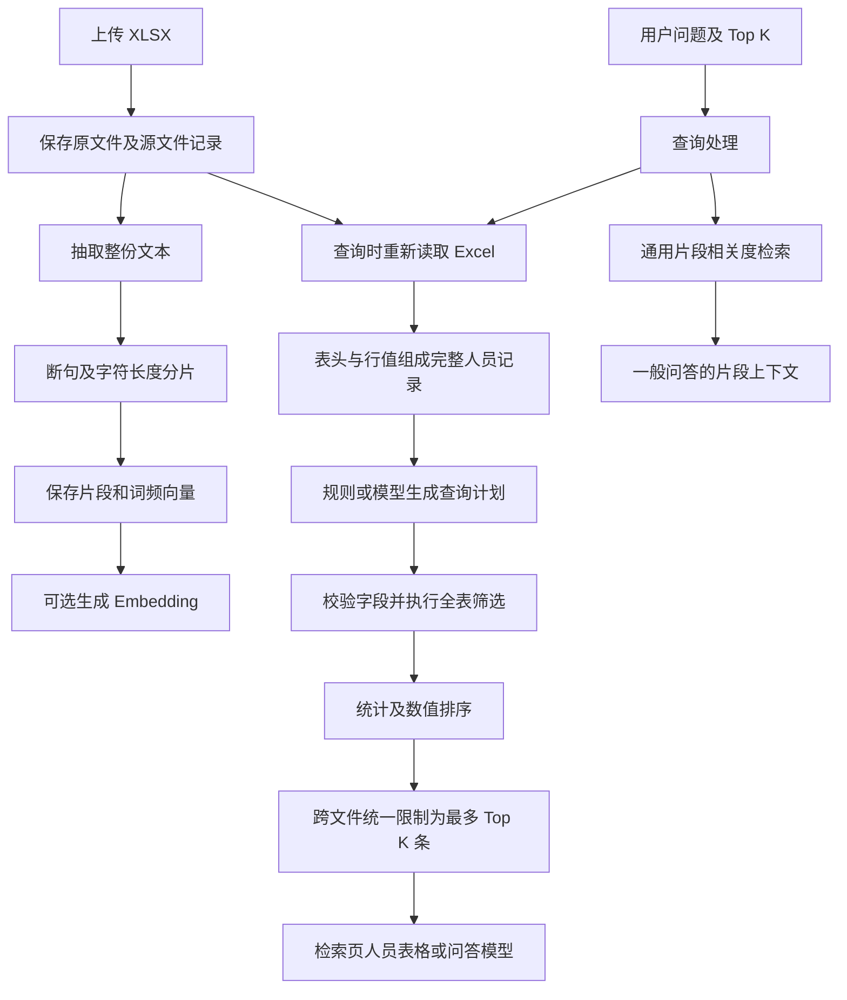

# 人才库分片与智能检索实现说明

说明日期：2026-09-17。本文依据当前工作区代码编写，描述已经实现的行为；示例姓名和机构均为虚构。

## 1. 当前架构：文本分片与人才整表查询并存

目前有两条数据处理流程：

| 流程 | 处理单位 | 主要用途 | 返回数量含义 |
| --- | --- | --- | --- |
| 通用文档检索 | 文本片段 Chunk | 从资料中查找相关描述、生成一般问答 | Top K 个片段 |
| 人才结构化查询 | Excel 中的一条人员记录 | 按领域、机构等条件筛选，统计与指标排名 | 所有文件合计最多 Top K 条人员记录 |

**人才查询并不是把所有片段重新绑定到某个人，而是直接读取原始 Excel，通过同一行的列名与单元格值恢复完整人员记录。**

当前没有独立的人才数据库表、领域关联表，也没有持久化的 `person_id → chunk_id` 映射。普通片段与人才记录通过所属源文件关联，但两者不是一一对应。



图中表示逻辑分工。实际接口可能先完成通用检索，再生成结构化结果；结构化查询成功时，会丢弃普通片段结果，避免片段里额外的人名突破返回数量上限。

## 2. 文件上传后保存了什么

入口：`POST /api/knowledge/bases/{knowledge_base_id}/upload`。

处理顺序：

1. 检查知识库状态、文件后缀及大小，单文件最大 20 MB。
2. 以 `UUID-原文件名` 保存文件，默认目录为后端工作目录下的 `storage/uploads`。
3. 建立源文件记录，保存文件名、类型、存储路径、处理状态等。
4. 建立知识库与源文件的关联。
5. 抽取文本，保存到源文件记录的 `content_text`。
6. 将文本切片，保存片段内容和词频向量。
7. 有向量化配置时，尝试生成并保存 Embedding。

相关数据对象：

| 对象 | 职责 |
| --- | --- |
| `KnowledgeSourceModel` | 原文件、解析文本、状态、片段数量 |
| `KnowledgeBaseSourceModel` | 知识库与源文件的关联 |
| `KnowledgeChunkModel` | 单个文本片段及其源文件、编号、内容、词频向量 |
| `KnowledgeChunkEmbeddingModel` | 片段对应的稠密向量及模型信息 |
| `TalentSheet` | 查询时在内存中构建的人员表，不是数据库表 |

代码：[上传流程](../backend/app/api/routes/knowledge.py)、[数据模型](../backend/app/db/models.py)。

## 3. 目前具体如何分片

### 3.1 Excel 先转换为普通文本

`_parse_xlsx()` 使用以下参数读取文件：

```python
load_workbook(io.BytesIO(data), read_only=True, data_only=True)
```

- 遍历工作表，再遍历每一行。
- 单元格转为字符串，空单元格转为空字符串。
- 去掉每行末尾的空单元格，保留行内空位。
- 同一行的单元格使用 ` | ` 连接。
- 不同 Excel 行用换行连接。
- 非空工作表前加 `工作表：工作表名称`。
- 工作表之间用空行分隔。

例如：

```text
工作表：Sheet1
姓名 | 当前机构 | 领域 | OpenAlex h-index
示例人员甲 | 示例大学 | 具身智能 | 78
示例人员乙 | 示例研究院 | 量子计算 | 25
```

这里的表头只是文本中的一行，**不会自动重复附加到每位人员或每个片段前面**。公式读取 Excel 文件中保存的计算结果，后端不执行公式重算。

### 3.2 文本标准化

`_normalize_text()` 做以下处理：

- 将 Windows、Mac 等换行形式统一为 `\n`。
- 连续空格和制表符合并为一个空格。
- 三个及以上连续换行压缩为两个换行。
- 去掉文本首尾空白。

### 3.3 按段落、标点和字符长度切分

当前配置默认值：

```dotenv
APP_KB_CHUNK_MAX_CHARS=480
APP_KB_CHUNK_OVERLAP_CHARS=80
```

切分依据是 **字符长度**，不是模型 Token 数。

执行过程：

1. `_segment_text()` 先按空行划分段落。
2. 再按中英文句号、问号、感叹号、分号等标点拆成句段。
3. 单个句段超过 480 字符时，先按字符长度截分。
4. `split_into_chunks()` 将句段依次装入缓冲区。
5. 加入下一句段将超过目标长度时，输出当前片段。
6. 通常将上一片段末尾的 80 个字符带到下一片段作为上下文。
7. 片段编号在每个源文件内部从 0 开始递增。

需要注意代码的实际边界：

- 480 是目标长度，当前实现不是严格的硬上限。刷新缓冲区后保留重叠尾部，再加入较长句段，可能超过 480。
- 80 字符重叠不是“上一位人员”或“上一句完整语义”，可能截在姓名、字段或句子中间。
- Excel 单行换行不会被当作必须保留的人员边界。
- 工作表之间也没有强制禁止合并片段的边界。
- 句号断句可能拆开网址、小数等内容。

### 3.4 分片与人数不对应

例如一位人员有很长的简介、经历和成果，可能被拆成多个片段；相邻人员的短记录，也可能进入同一个片段。

因此：

```text
片段数量 ≠ 人员记录数量
召回 5 个片段 ≠ 找到 5 位完整人员
```

当前人才结构化查询正是为了绕开这个限制，不再用片段内容推断整表人数、领域归属或完整排名。

代码：[文本解析与分片](../backend/app/services/ingestion.py)、[默认配置](../backend/app/core/config.py)。

## 4. 人才与领域是如何对应的

### 4.1 查询范围先由知识库限定

`list_active_spreadsheet_sources()` 查找：

- 与当前知识库有关联的源文件；未指定知识库时，范围为所有活跃知识库的关联源文件。
- 知识库处于 `active` 状态。
- 源文件处于 `parsed` 状态。
- 文件名后缀为 `.xlsx`。

结构化人才查询目前只接入 XLSX。CSV 虽然支持上传和预览，但没有接入这条人才整表查询路径。

### 4.2 识别人员表头

`read_talent_sheets()` 将工作表的第一个非空行当作表头，并寻找以下姓名列之一：

```text
姓名、人员姓名、员工姓名、name、full name
```

姓名列识别使用大小写无关比较。如果第一个非空行没有这些字段，该工作表不会作为人才表处理。

因此，Excel 开头若放了合并的大标题，而真正表头在第二、三行，当前代码不会自动向下寻找正确表头。

### 4.3 按同一列的位置绑定字段值

对表头之后的每一行，执行等价于以下逻辑的映射：

```python
fields = {
    header[index]: row[index]
    for index in range(len(header))
    if header[index]
}
```

实际代码还会补空值、去掉首尾空白，并只保留姓名非空的记录。

得到的示例记录如下：

```json
{
  "row": 5,
  "fields": {
    "姓名": "示例人员甲",
    "当前机构": "示例大学",
    "领域": "具身智能",
    "OpenAlex h-index": "78",
    "Google Scholar h-index": "95"
  }
}
```

**“示例人员甲属于具身智能领域”的依据，是这一行的 `领域` 单元格，而不是模型从某个片段中猜出的标签。**

### 4.4 保留来源定位

记录所属的 `TalentSheet` 保存：

```text
source_id + filename + sheet + 原始 Excel 行号
```

这组信息能定位当前上传版本中的一条记录，但不是永久人员身份 ID。重新上传、插入行或调整顺序后，行号可能变化。

当前不会按姓名跨文件去重，也不会自动合并同名人员、ORCID 或 OpenAlex ID 相同的记录。

### 4.5 领域标签不会自动生成

- 常见规则直接从 `领域` 列中收集已有值。
- `未来产业方向`、`细分关键词`、`研究方向` 等字段可作为模型查询计划中的筛选字段。
- 未填写的领域不会自动通过简介补全。
- 不存在统一领域词典、领域层级树、自动标签训练或向量聚类。
- 默认领域规则使用 `contains`，即标准化后的子串匹配；并不是严格的标签集合匹配。

代码：[人才记录读取及查询](../backend/app/services/talent_search.py)、[源文件范围限定](../backend/app/repositories/sqlite.py)。

## 5. 自然语言问题如何变成查询条件

### 5.1 优先使用规则解析

`rule_plan()` 先尝试识别简单的“领域 + 指标 + 排序方向 + 数量”问题。

例如：

```text
帮我查询具身智能领域，并且按照 openlex h-index 排名
```

会尝试生成：

```json
{
  "filters": [
    {"field": "领域", "op": "contains", "value": "具身智能"}
  ],
  "sort_by": "OpenAlex h-index",
  "descending": true,
  "limit": 20
}
```

这里 `20` 是内部查询计划的默认值，后续还必须受到用户 Top K 限制，不表示最终展示 20 人。

规则还包括：

- 比较时忽略大小写，并移除空白、下划线和部分横线字符。
- 将 `openlex` 规范为 `openalex`。
- 将 `embodied ai`、`embodied intelligence` 对应到“具身智能”。
- 将 `AI for Science` 等有限别名对应到 `AI4S`。
- 尝试识别“前 N”“Top N”、升序、降序等表达。
- 若剩余条件无法可靠解释，或涉及多个领域、机构、数值范围等，不直接忽略这些内容，而是转入模型规划。

这是一组有限规则，不是任意同义词都能直接匹配。

### 5.2 规则未覆盖时，让模型生成 JSON 计划

系统向规划模型提供：

1. 用户问题。
2. 当前人才表真实列名集合。
3. `领域` 列中实际存在的领域值集合。

此规划步骤不需要把整份人员表的所有行发送给模型。

模型只生成查询条件，不执行查询。例如：

```json
{
  "filters": [
    {"field": "领域", "op": "contains", "value": "具身智能"},
    {"field": "当前机构", "op": "contains", "value": "示例大学"},
    {"field": "OpenAlex h-index", "op": "gte", "value": "10"}
  ],
  "sort_by": "OpenAlex h-index",
  "descending": true,
  "limit": 5
}
```

问答使用本次选择的模型；检索测试使用默认模型。需要模型规划时，会额外产生一次模型调用；成功调用的实际用量会进入现有调用记录。

### 5.3 校验后才能执行

`TalentPlan` 和 `validate_plan()` 限制：

| 项目 | 当前约束 |
| --- | --- |
| 筛选条件数量 | 最多 8 个 |
| 可用操作符 | `contains`、`eq`、`gte`、`lte`、`not_contains` |
| 多条件关系 | AND，所有条件都要满足 |
| 字段 | 必须属于读取到的真实表头 |
| 数值条件 | 阈值必须能解析为有效数字 |
| 排序字段 | 必须存在于真实表头中 |
| 计划中的数量 | 1–100，最终再受 Top K 限制 |

程序不执行模型生成的 SQL、Python 或其他代码。计划无法解析、字段不存在等情况下，会提示明确查询条件。

需要区分两种保证：代码可以校验结构和字段是否合法，但不能完全证明模型没有误解自然语言。OR、分组、多指标排序等复杂语义主要通过规划提示要求拒绝，当前没有完整的语义等价校验器。

代码：[规划模型入口](../backend/app/api/routes/knowledge.py)、[计划定义与校验](../backend/app/services/talent_search.py)。

## 6. 筛选、数值排序和 Top K 如何执行

### 6.1 筛选完整记录

`execute_plan()` 遍历每个工作表中的完整人员记录：

```python
matched = [record for record in sheet.rows if matches_all_filters(record)]
```

文本条件采用标准化后的包含、相等或排除判断；数值条件转换为数值后比较。缺少查询必需列的工作表会记录错误，不会猜测列的位置。

### 6.2 数值排序

`number_value()` 接受带可选正负号的普通整数、小数，转换前移除中英文逗号；转换结果还必须是有限数值。

```text
"100" → 100
"9" → 9
"0" → 0，属于有效值
空白、"未知"、"N/A" → 无效值
```

当前不解析百分号、单位、科学计数法、带说明文字的数值。排序时只保留可转换记录，缺失或无效值单独计数，不填成 0。

因此按降序排序时，100 会排在 9 前面，不会按字符串字典序排列；OpenAlex 和 Google Scholar 指标由列名分别读取。

未指定排序字段时，保留源文件和原始行顺序，不额外计算人才推荐分数。指定单一数值指标时按该指标排序，没有单独的并列名次计算。

### 6.3 展示数量统一受 Top K 约束

两类接口都将页面数量传给 `talent_context()`：

```python
# 检索接口
talent_context(..., max_results=top_k)

# 问答及流式问答的准备阶段
talent_context(..., max_results=payload.top_k)
```

最终上限为：

```python
effective_limit = min(plan.limit, top_k)
```

当前页面与接口的 Top K 默认是 5，可选范围是 1–12。

| 页面设置 | 计划要求 | 最多展示 |
| --- | --- | --- |
| Top 5 | 默认 20 | 5 条 |
| Top 5 | 前 3 | 3 条 |
| Top 5 | 前 100 | 5 条 |
| Top 12 | 默认 20 | 12 条 |

这里的上限跨所有命中文件共同生效，不是每个文件各返回 5 条。

执行顺序：

1. 扫描完整工作表，计算条件匹配数。
2. 有排序要求时，统计缺失值，并在每张表内数值排序。
3. 每张表最多取 `effective_limit` 条作为候选。
4. 合并各表候选；有排序字段时再做全局数值排序。
5. 全局只选择前 `effective_limit` 条。
6. 将选中的记录分回对应文件、工作表，保留各表统计数据。

没有指定排序时，候选按源文件读取顺序和表内行顺序截取。响应仍按文件与工作表分组，并不是一个扁平的全局排名数组。

### 6.4 区分几个数量

| 返回字段 | 含义 |
| --- | --- |
| `scanned_records` | 当前工作表读取到的姓名非空记录数 |
| `matched_records` | 满足筛选条件的记录数 |
| `missing_sort_values` | 匹配记录中缺失或无法解析排序指标的数量 |
| `rankable_records` | 排序时有有效指标的记录数；未排序时等于匹配数 |
| `returned_records` | 当前工作表最终实际返回的记录数 |
| `truncated` | 可展示记录数是否大于实际返回数 |
| `max_returned_records` | 所有文件合计展示上限，位于结构化上下文顶层 |

以本会话曾核对的 906 条记录版本为例，“具身智能”命中 82 条；按 OpenAlex h-index 排序时，37 条有有效指标，45 条缺失。Top 5 只返回其中前 5 条，同时可以说明总共匹配 82 条。这些数字是当时文件内容的核对结果，不是代码中写死的值，也不是按唯一身份去重后的人数。

## 7. 普通片段检索如何工作

普通文本检索依然保留，用于人才筛选之外的一般资料问答。

- `_tokenize()` 提取连续英文字母/数字，以及单个中文字符。
- `_vectorize()` 保存这些元素的出现次数。
- 查询与片段通过词频向量余弦相似度计算词法相关度。
- 有可用查询向量和片段 Embedding 时，可结合稠密向量余弦相似度。
- 默认词法与向量权重分别为 0.45 和 0.55；相关配置可覆盖默认值。
- 没有可用向量信号时回退到词法相关度，按得分取 Top K 片段。

这不是 BM25，也没有独立的学习型重排模型。该相关度分数与人才的 h-index、领域筛选条件是不同的概念。

代码：[片段检索实现](../backend/app/repositories/sqlite.py)、[分词和词频向量](../backend/app/services/ingestion.py)。

## 8. 检索结果如何进入前端和模型

### 8.1 检索测试页

`GET /api/knowledge/search` 返回：

```json
{
  "query": "具身智能领域按OpenAlex h-index排名",
  "hits": [],
  "talent_results": [],
  "talent_notice": null
}
```

以上为字段形状示意，实际人员分组结果填入 `talent_results`。结构化结果存在时，清空普通 `hits`，避免再显示额外人才片段。

前端展示文件名、工作表、命中数、人员字段、排序值和原表行号；无法确定结构化条件时显示 `talent_notice`。最近搜索也保存结构化结果快照。

### 8.2 知识问答与流式问答

`POST /api/knowledge/ask` 和 `POST /api/knowledge/ask/stream` 共用 `_prepare_ask()`。

结构化查询成功后：

1. 将人员字段、筛选计划、统计数和来源行号序列化为 JSON 上下文。
2. 清空普通片段和网页上下文，防止引入上限以外的人名。
3. 要求模型依据返回记录组织表格，保持指标和排序，说明“共匹配 X 条，本次展示 Y 条”。
4. 为实际返回的每条人才记录生成 `evidence_index`，要求模型以 `（Record 1）` 等标记引用，不给人员记录编造 Chunk 编号。
5. 非流式响应及流式 `meta` 事件返回 `row_sources`，包含证据编号、`source_id`、文件名、工作表、原始行号和字段值。
6. 前端将 Record 引用渲染成“证据 1”按钮，点击展开并定位“参考来源”中的人才证据卡片。卡片展示原表字段，原表记录的 HTTP/HTTPS 网页链接可以打开，但不表示网页内容已实时核验。

数据库查询与返回记录数量由程序控制；最终问答文字仍由模型生成。目前没有在生成之后再解析答案并硬性验证“恰好只列出这些人”的后处理器。

### 8.3 引用外观与底层分片无关

前端将 `Chunk 243` 等标记显示为“来源 243”或上标按钮，只改变引用展示，不会改变分片内容、人员记录或领域绑定方式。

普通 Chunk 编号在每个源文件内独立编号，不是人员 ID，也不是全库唯一编号。结构化人才结果应使用文件、工作表和行号定位。

代码：[问答和检索接口](../backend/app/api/routes/knowledge.py)、[前端结果展示](../frontend/src/views/RetrievalWorkspace.vue)、[引用渲染](../frontend/src/lib/renderMarkdown.ts)。

## 9. 统计与预览是另外两条辅助流程

### 全表统计

`spreadsheet_stats.py` 对数量类问题额外读取原始工作簿，计算非空行、姓名非空记录、不同姓名文本数。这里的通用整表统计没有执行领域或机构过滤，条件统计应以人才查询结果的 `matched_records` 为准。

### 文件预览

`file_preview.py` 直接读取 XLSX/CSV 内容，按页展示非空行和原始行号，与检索片段和人才 Top K 无关。

例如：预览可以每页看 50 行，同时人才查询仅展示 5 条。这是不同功能的分页与召回设置。

代码：[全表统计](../backend/app/services/spreadsheet_stats.py)、[预览接口处理](../backend/app/services/file_preview.py)。

## 10. 当前边界与后续可改进项

以下边界来自现有实现，不应被理解为已经具备完整的人才数据库或知识图谱能力：

| 当前情况 | 实际影响 |
| --- | --- |
| 通用分片仍按字符和标点 | 长简介可能拆开，字段名不会自动重复 |
| 人才查询每次读取原 XLSX | 无需重新导入即可使用，但大文件和并发查询有读取开销 |
| 人才记录只在内存中构建 | 尚无数据库索引、人员实体持久化和结构化记录缓存 |
| 默认使用第一非空行作表头 | 多行表头、开头大标题需要事先整理 |
| 通过列名形成字典 | 重复列名可能覆盖；除少量姓名别名外，没有通用字段别名表 |
| 领域取自原表或明确查询字段 | 不自动补全领域，不保证任意同义表达都能识别 |
| 无身份级去重 | 同一人员在多个文件中可能作为多条记录出现 |
| 排序读取已有指标值 | 不会实时从 OpenAlex 或 Google Scholar 更新指标 |
| 查询计划支持 AND 与单一排序字段 | 多领域 OR、分组汇总、多指标综合评分尚未系统实现 |
| 缺乏条件级语义校验 | 模型可能误解自然语言，重要查询应核对返回条件及原表 |
| 结构化结果可控，回答文本由模型生成 | 提示词约束不能替代最终答案的程序校验 |

后续若要进一步产品化，可考虑以下方向，**这些不属于当前已实现功能**：

1. 人才入库时建立独立人员记录表、字段索引和来源版本信息。
2. 按“一人一条记录”组织片段，长简介子片段重复携带姓名、人员 ID 与领域。
3. 建立 `person_id → source_id / sheet / row / chunk_id` 可追溯映射。
4. 将领域规范为可管理的标签集合，增加别名、标签校验和人工修订。
5. 以稳定身份标识进行去重，明确不同来源冲突时的合并规则。
6. 用查询 AST 表达 AND/OR、分组与多字段排序，并给用户展示可检查的查询条件。
7. 对结构化回答采用程序生成表格或做答案校验，进一步降低模型改写数值的风险。

## 11. 代码与测试索引

| 模块 | 主要入口 | 文件 |
| --- | --- | --- |
| 文件导入 | `_ingest_upload` | [knowledge.py](../backend/app/api/routes/knowledge.py) |
| 文本分片 | `_parse_xlsx`、`_segment_text`、`split_into_chunks` | [ingestion.py](../backend/app/services/ingestion.py) |
| 人才记录与领域字段 | `read_talent_sheets` | [talent_search.py](../backend/app/services/talent_search.py) |
| 规则与计划校验 | `rule_plan`、`validate_plan` | [talent_search.py](../backend/app/services/talent_search.py) |
| 完整记录筛选和限量 | `execute_plan`、`talent_context` | [talent_search.py](../backend/app/services/talent_search.py) |
| 模型规划 | `_talent_query_planner` | [knowledge.py](../backend/app/api/routes/knowledge.py) |
| 知识库范围与片段评分 | `list_active_spreadsheet_sources`、`search_chunks` | [sqlite.py](../backend/app/repositories/sqlite.py) |
| 人才查询回归 | 排序、字段对应、缺失值、隔离、Top K | [test_talent_search.py](../backend/tests/test_talent_search.py) |
| 整表统计回归 | 900 条记录、误导性文件名、空值和同名 | [test_spreadsheet_stats.py](../backend/tests/test_spreadsheet_stats.py) |

核心验证场景包括：表头换序后指标仍正确对应；100 排在 9 前；OpenAlex 不与 Google Scholar 混用；0 是有效指标；空值不参与排名；知识库之间不混入记录；普通问答和流式问答都获得结构化证据；跨文件合计最多返回 Top K 条，但完整匹配数保持不变。

运行后端测试：

```bash
cd backend
.venv/bin/python -m unittest discover -s tests -v
```
